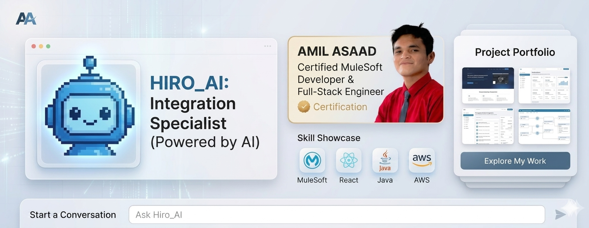

I built my portfolio with Hiro_AI as an integrated assistant that represents me, Amil Asaad, a Certified MuleSoft Developer and Full-Stack Engineer. It showcases my work while Hiro provides clear, professional answers about my background, skills, and projects, making the experience more interactive and engaging.

## Run Locally

**Prerequisites:**  Node.js

1. Install dependencies:
   `npm install`
2. Set the `API_TOKEN` in [.env](.env) to your API Key
3. Run the app:
   `npm run dev`
